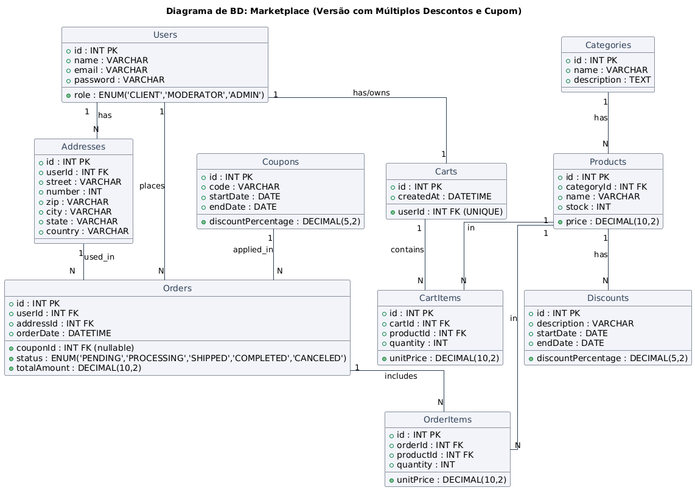

# Banco de Dados para E-commerce

## Sumário

1. [Users (Usuários)](#1-users-usuários)  
2. [Addresses (Endereços)](#2-addresses-endereços)  
3. [Categories (Categorias)](#3-categories-categorias)  
4. [Discounts (Descontos Administrativos)](#4-discounts-descontos-administrativos)  
5. [Coupons (Cupons)](#5-coupons-cupons)  
6. [Products (Produtos)](#6-products-produtos)  
7. [Carts (Carrinho)](#7-carts-carrinho)  
8. [CartItems (Itens do Carrinho)](#8-cartitems-itens-do-carrinho)  
9. [Orders (Pedidos)](#9-orders-pedidos)  
10. [OrderItems (Itens do Pedido)](#10-orderitems-itens-do-pedido)  

---

## 1. Users (Usuários)

**Atributos:**
- **id (PK)** — Identificador único.
- **name** — Nome do usuário.
- **email** — Endereço de e-mail para login.
- **password** — Senha (hash recomendável).
- **role** — Tipo do usuário; valores possíveis:
  - `CLIENT` (cliente que realiza compras)
  - `MODERATOR` (gerencia estoque, produtos)
  - `ADMIN` (controle total, incluindo categorias)

**Relacionamentos:**
- **1:N** com **Addresses** (um usuário pode ter vários endereços).
- **1:1** com **Carts** (um carrinho único por usuário).
- **1:N** com **Orders** (vários pedidos por usuário).

---

## 2. Addresses (Endereços)

**Atributos:**
- **id (PK)**
- **userId (FK)** — referencia o usuário dono do endereço.
- **street, city, state, zip, country** — campos de endereço.

**Relacionamentos:**
- Pertence a um **User** (via `userId`).
- **1:N** com **Orders** (vários pedidos podem usar o mesmo endereço).

---

## 3. Categories (Categorias)

**Atributos:**
- **id (PK)**
- **name** — Nome da categoria (ex.: "Eletrônicos", "Moda").
- **description** — Descrição da categoria.

**Relacionamentos:**
- **1:N** com **Products** (uma categoria pode ter muitos produtos).

---

## 4. Discounts (Descontos Administrativos)

**Atributos:**
- **id (PK)**
- **description** — Descrição (ex.: "Desconto de Natal").
- **discountPercentage** — Percentual de desconto.
- **startDate, endDate** — Vigência do desconto.

**Relacionamentos:**
- **M:1** com **Products**

---

## 5. Coupons (Cupons)

**Atributos:**
- **id (PK)**
- **code** — Código do cupom (ex.: "FRETEGRATIS10").
- **discountPercentage** — Percentual de desconto do cupom.
- **startDate, endDate** — Intervalo de validade.

**Relacionamentos:**
- **1:N** com **Orders** (um cupom pode ser usado em vários pedidos, de acordo com as regras).

---

## 6. Products (Produtos)

**Atributos:**
- **id (PK)**
- **categoryId (FK)**
- **name**
- **price**
- **stock** — Quantidade em estoque.

**Relacionamentos:**
- **1:N** com **CartItems**.
- **1:N** com **OrderItems**.

---

## 7. Carts (Carrinho)

**Atributos:**
- **id (PK)**
- **userId (FK)** — único (UNIQUE) para garantir apenas 1 carrinho por usuário.
- **createdAt** — Data/hora de criação.

**Relacionamentos:**
- **1:1** com **Users** (cada usuário tem um carrinho).
- **1:N** com **CartItems**.

---

## 8. CartItems (Itens do Carrinho)

**Atributos:**
- **id (PK)**
- **cartId (FK)**
- **productId (FK)**
- **quantity**
- **unitPrice** — preço unitário ao colocar o item no carrinho (útil se o preço do produto mudar).

**Relacionamentos:**
- Cada **cart** pode ter vários itens (1:N).
- Cada item pertence a um **product** específico.

---

## 9. Orders (Pedidos)

**Atributos:**
- **id (PK)**
- **userId (FK)**
- **addressId (FK)**
- **couponId (FK, opcional)**
- **orderDate**
- **status** — `ENUM('PENDING','PROCESSING','SHIPPED','COMPLETED','CANCELED')`
- **totalAmount** — Montante total do pedido.

**Relacionamentos:**
- **1:N** com **OrderItems**.
- Pertence a um **User**.
- Usa um **Address**.
- Pode (opcionalmente) usar um **Coupon**.

---

## 10. OrderItems (Itens do Pedido)

**Atributos:**
- **id (PK)**
- **orderId (FK)**
- **productId (FK)**
- **quantity**
- **unitPrice** — preço unitário do momento da compra.

**Relacionamentos:**
- Cada pedido pode ter vários itens (1:N).
- Cada item pertence a um produto.

---
